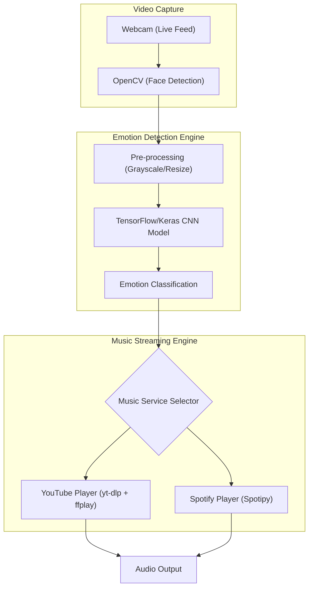

# 🎶 Emotion-Based Music Player
### Real-time Facial Emotion Detection & Music Streaming

<p align="center">
  
  
  
  
  
  
</p>

---

Emotion-Based Music Player is an interactive application that detects a user's facial emotion in real time using a webcam and plays music that matches the detected emotion. It utilizes a deep learning model for real-time sentiment analysis and dynamically sources music from either **YouTube** or **Spotify**.

---

## 💻 Tech Stack

**Computer Vision & Machine Learning**
* **Framework:** TensorFlow / Keras
* **Vision Library:** OpenCV (Haar Cascade Classifier)
* **Data Processing:** NumPy
* **Model:** CNN-based Deep Learning Emotion Model (`emotion_model.h5`)

**Music Integration**
* **YouTube Playback:** `yt-dlp` and `ffplay`
* **Spotify Playback:** Spotify Web API and `spotipy`

**Core Programming**
* **Language:** Python

---

## 🌐 System Architecture & Pipeline

The Emotion-Based Music Player processes live video feeds, runs inference via a CNN, and translates visual emotional cues into a curated audio experience.

### System Diagram



### 🧠 Detected Emotions

The CNN model classifies facial expressions into one of seven distinct emotional states:
* Angry
* Disgust
* Fear
* Happy
* Sad
* Surprise
* Neutral

Each emotion is dynamically mapped to a specific musical genre or playlist to ensure the audio perfectly complements the user's mood.

---

## 🤖 Core Features & Pipeline

| Feature | Description |
|-------|-------------|
| **Real-time Face Tracking** | 📸 Captures and isolates human faces from a live webcam feed using OpenCV's Haar cascades. |
| **Deep Learning Inference** | 🧠 Analyzes facial expressions instantly with a pre-trained Keras CNN model (`emotion_model.h5`). |
| **YouTube Streaming** | 🎵 Seamlessly fetches and plays emotion-appropriate audio streams from YouTube using `yt-dlp`. |
| **Spotify Integration** | 🎧 Automatically controls playback on your active Spotify session via the Spotify Web API. |

---

## 🚀 Installation & Setup

### 1. Clone the Repository
```bash
git clone https://github.com/JaleedAhmad/EmotionMusicPlayer.git
cd EmotionMusicPlayer
```

### 2. Install Dependencies
Navigate to the source directory and install the required Python packages:
```bash
cd emotion_music_player
pip install -r requirements.txt
```

### 3. Audio Backend Configuration

**For YouTube Audio Support:**
You must install `ffmpeg` (required by `ffplay`).
* **Ubuntu/Debian:** `sudo apt install ffmpeg`
* **macOS:** `brew install ffmpeg`
* **Windows:** Download from [ffmpeg.org](https://ffmpeg.org/) and add it to your PATH.

**(Optional) For Spotify Support:**
1. Go to the [Spotify Developer Dashboard](https://developer.spotify.com/dashboard/).
2. Create an application and get your Client ID and Client Secret.
3. Set the Redirect URI to `http://localhost:8888/callback`.
4. Create a `.env` file in the `emotion_music_player` directory:
```env
SPOTIPY_CLIENT_ID=your_client_id
SPOTIPY_CLIENT_SECRET=your_client_secret
SPOTIPY_REDIRECT_URI=http://localhost:8888/callback
```

---

## ▶️ Usage

### Run with YouTube Playback (Default)
By default, the application is configured to stream music from YouTube.
```bash
cd emotion_music_player
python emotion_detect.py
```

### Switch to Spotify Playback
To use Spotify instead:
1. Open the main script (`emotion_detect.py`).
2. Uncomment the `play_emotion_track(emotion)` line (Spotify execution).
3. Comment out the `play_youtube_audio(emotion)` line (YouTube execution).
4. Run the script. It will open your browser for authentication on the first run.

> **Note:** Only one active face is tracked and processed per frame. Music selection is based on the dominant detected emotion.

---

## 📁 Project Directory Map

```text
EmotionMusicPlayer/
├── emotion_music_player/
│   ├── emotion_detect.py        # Main webcam & emotion inference loop
│   ├── emotion_model.h5         # Compiled CNN weights for emotion classification
│   ├── youtube_player.py        # yt-dlp & ffplay integration script
│   ├── spotify_player.py        # Spotipy & Spotify API integration script
│   ├── model_summary.py         # Utility to inspect CNN architecture
│   ├── requirements.txt         # Project dependencies
│   └── .env                     # (User Created) Spotify API keys
├── examples/                    # Sample usage files
├── LICENSE                      # MIT License
└── README.md                    # Project Documentation
```

---

## 🚀 Future Enhancements
* **GUI Dashboard:** Add a graphical user interface (e.g., Tkinter or PyQt) for easier interaction and manual overrides.
* **Multi-Face Detection:** Average emotions across multiple detected faces to create a "group mood" playlist.
* **Temporal Smoothing:** Track emotions over a time window to prevent rapid, erratic song skipping.

---

## 👥 Author

**Jaleed Ahmad**

*Feel free to open issues or contribute to the project!*

---

## 📄 License

<details>
<summary>MIT License — click to expand</summary>

```
MIT License

Copyright (c) 2026 Jaleed Ahmad

Permission is hereby granted, free of charge, to any person obtaining a copy
of this software and associated documentation files (the "Software"), to deal
in the Software without restriction, including without limitation the rights
to use, copy, modify, merge, publish, distribute, sublicense, and/or sell
copies of the Software, and to permit persons to whom the Software is
furnished to do so, subject to the following conditions:

The above copyright notice and this permission notice shall be included in all
copies or substantial portions of the Software.

THE SOFTWARE IS PROVIDED "AS IS", WITHOUT WARRANTY OF ANY KIND, EXPRESS OR
IMPLIED, INCLUDING BUT NOT LIMITED TO THE WARRANTIES OF MERCHANTABILITY,
FITNESS FOR A PARTICULAR PURPOSE AND NONINFRINGEMENT. IN NO EVENT SHALL THE
AUTHORS OR COPYRIGHT HOLDERS BE LIABLE FOR ANY CLAIM, DAMAGES OR OTHER
LIABILITY, WHETHER IN AN ACTION OF CONTRACT, TORT OR OTHERWISE, ARISING FROM,
OUT OF OR IN CONNECTION WITH THE SOFTWARE OR THE USE OR OTHER DEALINGS IN THE
SOFTWARE.
```

</details>
